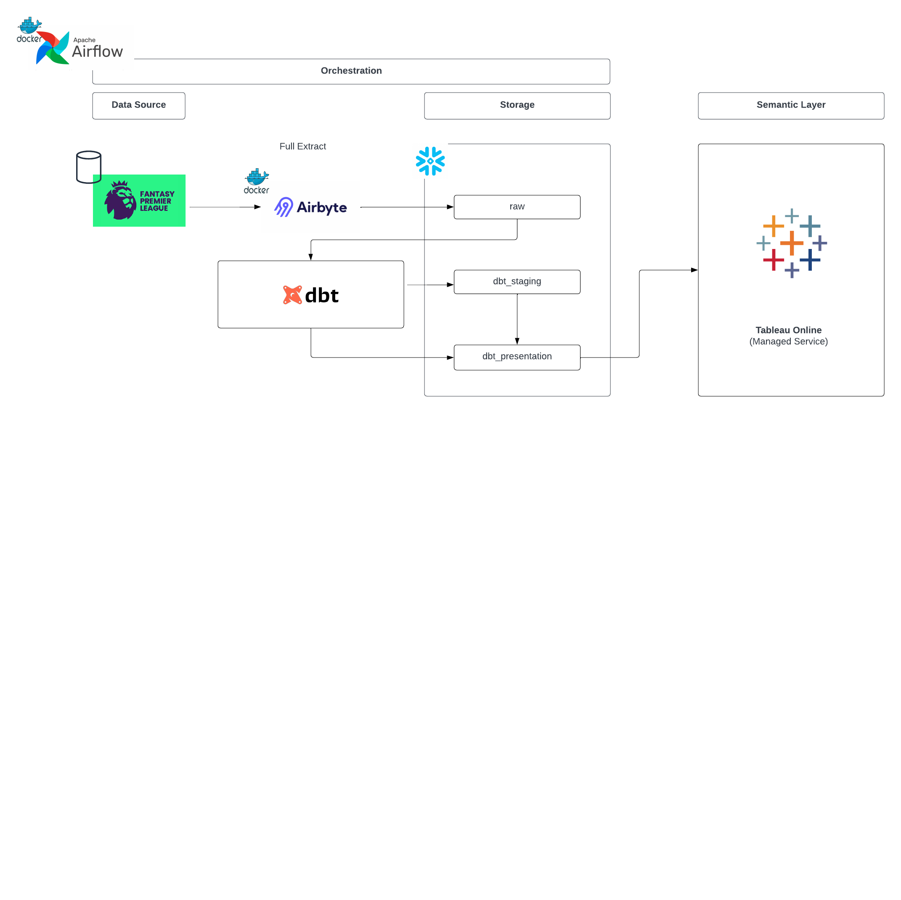

# About This Project

## Objective 
> Create a end-to-end data pipeline that will provide analytical datasets based on the Official Fantasy Premier League Game in a dashbaord

## Consumers 
The users of our datasets are anyone who interes\]ted in FPL statistics to inform the managerial decisions i.e. which players to select in their team

## Questions 

> - Who has scored the most goals, assists? 
> - Who is undervalued based on their performance and price? 
> - How well is a team doing? 

## Source datasets 
| Source name | Source type | Source documentation |
| - | - | - |
| Fantasy Premier League Website | Unauthenticated API | None | 

## Solution architecture





## How To Run This Project
### Snowflake
- Sign up and create your snowflake account 
- Take note of your locator 
### AWS
- Sign up a AWS Account
- Go to CloudFormation and create your tech stack using the provided Cloud Formation Template
- Create your Stack and have your .pem key name ready

### Airbyte
Follow airbyte deployment steps here: https://docs.airbyte.com/deploying-airbyte/on-aws-ec2
- Make sure to use either Terminal (Mac/Linux) or Git Bash (Windows).

Installing `docker-compose`: 

```
sudo curl -L "https://github.com/docker/compose/releases/download/v2.21.0/docker-compose-linux-x86_64" -o /usr/local/bin/docker-compose
sudo chmod +x /usr/local/bin/docker-compose
docker-compose --version
```
Running airbyte with `docker-compose`: 

```
sed 's/docker compose/docker-compose/g' run-ab-platform.sh | sudo tee run-ab-platform2.sh
sudo bash run-ab-platform2.sh
```
### Airflow
- Use fpl.py as your dag
- Set up the variable DBT_ENV as the Key and The Values like:
```
{"DBT_ENV_SECRET_ACCOUNT":"[YOUR SNOWFLAKE LOCATOR].[ap-southeast-2]","DBT_ENV_SECRET_USER":"<USER>","DBT_ENV_SECRET_PASSWORD":"<PASSWORD>","DBT_ENV_SECRET_ROLE":"DBT_RW","DBT_ENV_SECRET_WAREHOUSE":"ETL","DBT_ENV_SECRET_DATABASE":"FPL","DBT_ENV_SECRET_SCHEMA":"dbt"}
```

